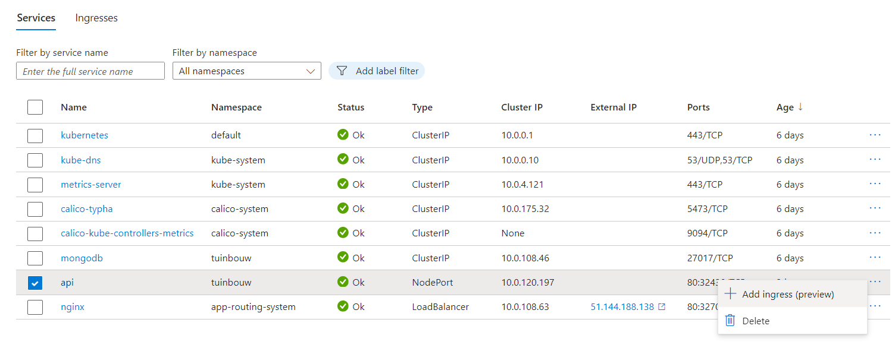

# Kubernetes & Netlify

## Azure Kubernetes Service (AKS) & Netlify

### Setup kubernetes

Make a new resource group & create a new AKS cluster

Than open the Azure Cloud Shell and run the following commands:

```bash
az aks get-credentials --resource-group tuinbouw --name aks-tuinbouw
```

Create a namespace for the project in the cluster

Switch to the namespace

```bash
kubectl config set-context --current --namespace=tuinbouw
```

### Push images to Docker Hub

First go to docker-compose-production.yml and change the image names to your own docker hub account

Push the images to the Docker Hub

```bash
docker compose -f .\infrastructure\docker-compose-production.yml push
```

### Add google credentials with Kubernetes secrets

First add a firebase-admin credentials file to the cluster

Open the Azure Cloud Shell and run the following commands:

```bash
touch credentials.json
```

Open the file

```bash
nano credentials.json
```

Copy the firebase-admin credentials to the file

```bash
kubectl create secret generic my-google-secret --from-file=credentials.json
```

### Add all the Kubernetes files to the dashboard

Now apply all the Kubernetes files in the `kubernetes` folder 

Go to the dashboard

- Add mongo presistent volume claim & presistent volume to the dashboard
- Add all the services to the dashboard
- Add configmap to the dashboard
- Add all the deployments to the dashboard

When your services is added copy the external IPs and place inside the `configmap.yaml` file

```yaml
# configmap-api.yaml
apiVersion: v1
kind: ConfigMap
metadata:
  name: api-configmap
  namespace: tuinbouw
data:
  MAIL_USER: # mail user
  MAIL_PASSWORD: # mail password
  MAIL_FROM: noreply@noreply.com
  URL_FRONTEND: # external ip of the frontend service
  DB_HOST: mongodb
  DB_PORT: '27017'
  DB_NAME: api
  NODE_ENV: production
  FIREBASE_STORAGE_BUCKET: # firebase storage bucket
  CLI_PATH: ./packages/api/dist/cli.js
  GOOGLE_APPLICATION_CREDENTIALS: /app/google-credentials/credentials.json
  PORT: '80'
```

### Cloudflare ssl

Make a ssl certificate in cloudflare

Than make a keyvault in Azure and add the ssl certificate to the keyvault


### Add ingress to the api

Than you need to make a ingress for the api

Go to the dashboard of the cluster > Services and ingresses > On Services click 3 dots > Create ingress

(If you don't see the option to create a ingress you need to install the ingress addon)



```text
Ingress name: api-ingress
Namespace: tuinbouw
Service: api (name of the service)
Certificate: Add here the certificate from the keyvault 
Domain name: I use here a subdomain api-tuinbouw.<domain-name> (i have made a subdomain in cloudflare)
```

Review and create

### Deploy the frontend to Netlify

Go to netlify and create a new site from github

Add the following environment variables

```bash
VITE_apiKey=
VITE_authDomain=
VITE_projectId=
VITE_storageBucket=
VITE_messagingSenderId=
VITE_appId=

VITE_BACKEND_URL=https://api-tuinbouw.<domain-name>/graphql

VITE_TOMTOM_API_KEY=

VITE_OPENWEATHER_apiKey=

VITE_LOGROCKET_ID=
```

### Rebuild the api image

We need to rebuild the api image with the new environment variables (frontend url)

Add the frontend url 

```bash
MAIL_USER=
MAIL_PASSWORD=
MAIL_FROM=noreply@noreply.com

URL_FRONTEND= #Netlify frontend url
DB_HOST=mongodb
DB_PORT=27017
DB_NAME=api

NODE_ENV=production

FIREBASE_STORAGE_BUCKET=

CLI_PATH=./packages/api/dist/cli.js
```

Rebuild the image and push it to the Docker Hub

```bash
docker compose -f .\infrastructure\docker-compose-production.yml push
```

### Restart the api deployment in AKS cluster

Go to Azure Cloud Shell and run the following commands:

```bash
kubectl rollout restart deployment api
```


